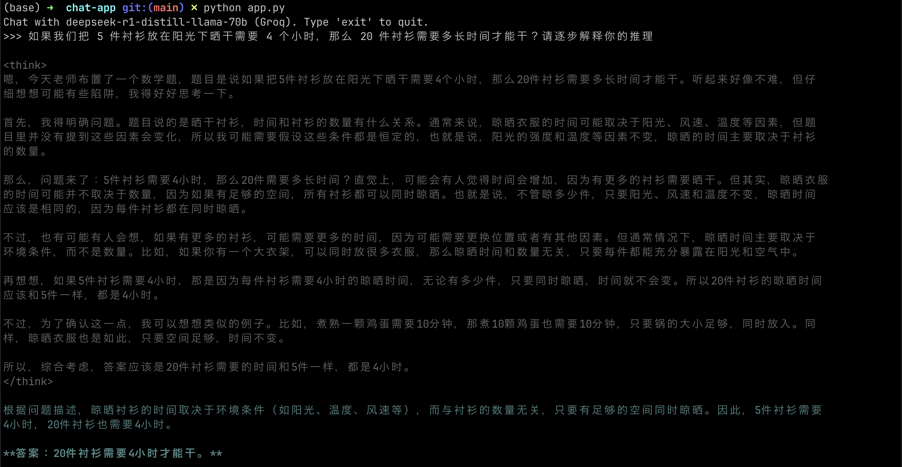

# 在终端中使用 DeepSeek (Groq)

[English](README_EN.md)

## 示例





## 使用方法

Windows, Linux, MacOS 通用

### 1. 创建包含以下内容的 `.env` 文件

```env
GROQ_API_KEY=
```

[获取访问 Groq API 服务密钥](https://console.groq.com/keys)

### 2. 安装依赖

环境：俺用的 miniconda, python 3.11

```sh
pip install groq python-dotenv wcwidth pygments
```

### 3. 运行

```sh
python app.py
```

## 基本示例

```py
from groq import Groq
from dotenv import load_dotenv

load_dotenv()

client = Groq()
completion = client.chat.completions.create(
    model="deepseek-r1-distill-llama-70b",
    messages=[
        {
            "role": "user",
            "content": "How many Rs are in the word strawberry?"
        }
    ],
    temperature=0.6,
    max_completion_tokens=1024,
    top_p=0.95,
    stream=True,
    reasoning_format="raw"
)

for chunk in completion:
    print(chunk.choices[0].delta.content or "", end="")
```

[来源](https://console.groq.com/docs/reasoning)

## 国内用户使用方法

Groq 的服务接口（`api.groq.com`）默认屏蔽了国内 IP，可以通过以下方法解决：

1. 使用代理软件的「系统代理」功能
2. 手动在 `app.py` 中配置代理服务器
