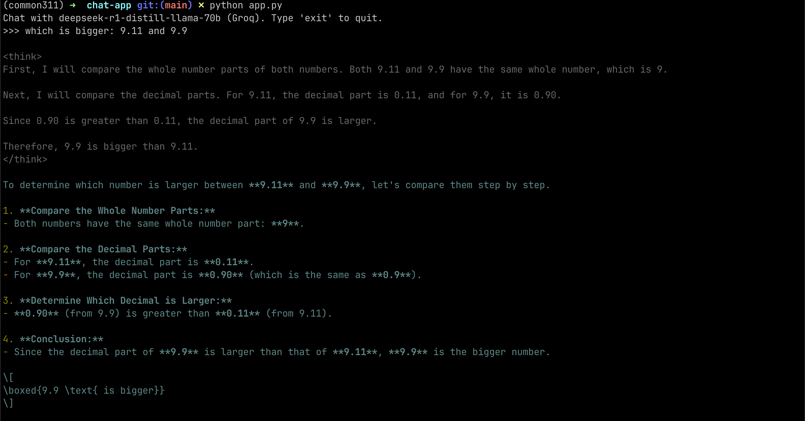

# Chat with DeepSeek R1 Distill Llama 70B (Groq) in Terminal

## Examples




## Usage

Works on Windows, Linux, MacOS

### 1. Create a `.env` file with the following content

```env
GROQ_API_KEY=
```

[Get your GROQ_API_KEY](https://console.groq.com/keys)

### 2. Install dependencies

Environment: I use miniconda, python 3.11

```sh
pip install groq python-dotenv wcwidth pygments
```

### 3. Run the application

```sh
python app.py
```

## Reference

- [GroqCloud Makes DeepSeek R1 Distill Llama 70B Available](https://groq.com/groqcloud-makes-deepseek-r1-distill-llama-70b-available/)
- [Rate Limits of GroqCloud API](https://console.groq.com/settings/limits)

## Basic Example

```py
from groq import Groq
from dotenv import load_dotenv

load_dotenv()

client = Groq()
completion = client.chat.completions.create(
    model="deepseek-r1-distill-llama-70b",
    messages=[
        {
            "role": "user",
            "content": "How many Rs are in the word strawberry?"
        }
    ],
    temperature=0.6,
    max_completion_tokens=1024,
    top_p=0.95,
    stream=True,
    reasoning_format="raw"
)

for chunk in completion:
    print(chunk.choices[0].delta.content or "", end="")
```

[Source](https://console.groq.com/docs/reasoning)
